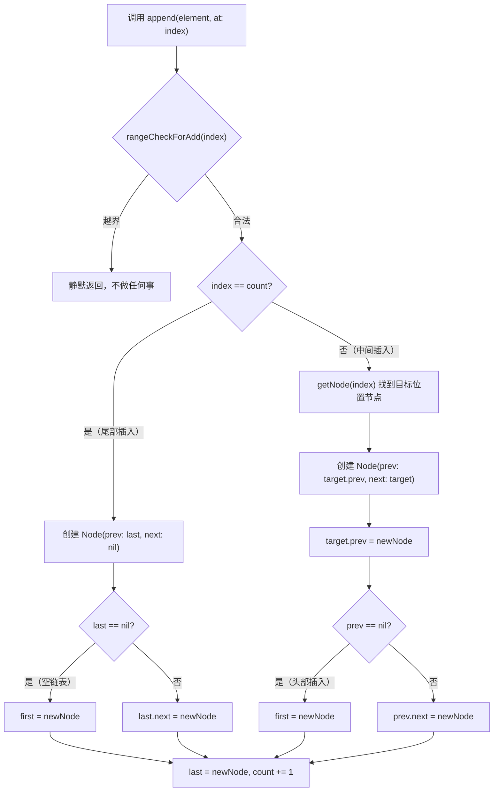
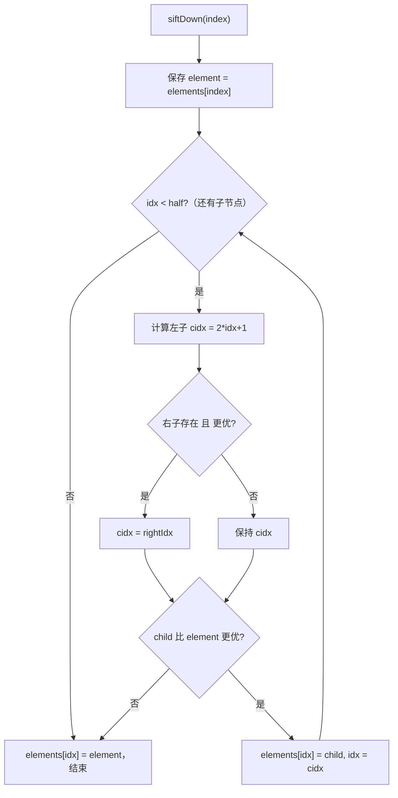
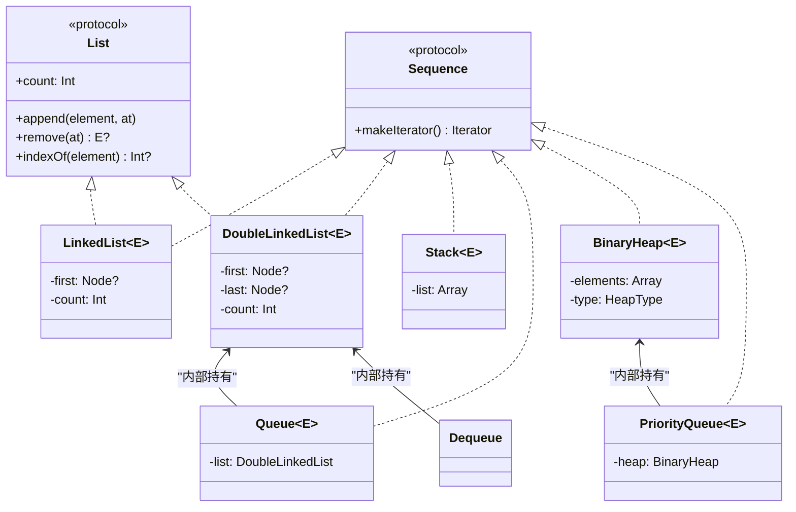

> **注：** 本文档由 **claude-opus-4-6** 模型自动生成。

# 📖 SwiftSTL 源码全景解析

## 🌟 小白导读

**一句话大白话：** SwiftSTL 就像是给 Swift 补齐的一套"标准零件箱"——Swift 标准库只给了你 Array/Dictionary/Set 三把扳手，这个库把链表、栈、队列、堆这些经典数据结构全做好了，拿来就能用。

**生活类比：** 想象你开了一间厨房，Swift 标准库只给了你菜刀、锅和砧板（Array/Dict/Set），但你做复杂菜式时还需要蒸笼（Stack）、传送带（Queue）、优先叫号器（PriorityQueue）。SwiftSTL 就是这套齐全的厨具包。

**读前预期：**
- 读完"核心概念"后，你将能理解：每种数据结构的适用场景和底层存储策略
- 读完"源码剥洋葱"后，你将能看懂：链表节点操作、堆的上滤下滤算法如何工作
- 读完"难点突破"后，你将彻底搞清楚：Node 类型为何必须是 class、Iterator 如何隐藏内部细节、heapify 的 O(n) 为何成立

---

## 📋 目录
- [项目概述与技术栈](#项目概述与技术栈)
- [目录结构](#目录结构)
- [架构全景（附生活类比）](#架构全景附生活类比)
- [入口与初始化流程](#入口与初始化流程)
- [关键业务流程图解](#关键业务流程图解)
- [核心源码剥洋葱（三层深度）](#核心源码剥洋葱三层深度)
- [错误处理与安全边界](#错误处理与安全边界)
- [关键类型与接口定义](#关键类型与接口定义)
- [难点突破（逐个攻克）](#难点突破逐个攻克)
- [为什么要这样设计？](#为什么要这样设计)
- [避坑指南](#避坑指南)

---

## 🎯 项目概述与技术栈

SwiftSTL 是一个纯 Swift 数据结构库，填补 Swift 标准库在链表、栈、队列、堆等经典数据结构上的空缺。面向 iOS/macOS 开发者，通过 CocoaPods 分发，也可手动拖入 Xcode 工程使用。

**技术栈：**

| 技术/库 | 版本 | 在本项目中的具体角色 |
|---|---|---|
| Swift | 5.0+ | 核心实现语言，利用泛型+协议构建类型安全的数据结构 |
| Xcode Project | — | 构建系统，含 Example target 用于演示/测试 |
| CocoaPods | v1.10 | 分发渠道，`SwiftSTL.podspec` 定义源码文件和平台要求 |
| Foundation | — | 仅 `import`，实际未使用任何 Foundation API |

**核心特性：**
- 全部数据结构均为泛型 struct（值语义），内部 Node 为 class（引用语义）
- 统一遵循 Swift `Sequence` 协议，支持 `for-in` / `map` / `filter`
- 链表类共享 `List` 协议，提供一致的增删查改接口
- BinaryHeap 支持 O(n) 批量建堆（自底向上 heapify）

---

## 📂 目录结构

```
SwiftSTL/
├─ SwiftSTL/                    # 库源码（CocoaPods 发布内容）
│   ├─ List.swift               # List 协议 + 默认实现 + _debugPrint 工具函数
│   ├─ LinkedList.swift         # 单向链表（List + Sequence）
│   ├─ DoubleLinkedList.swift   # 双向链表（List + Sequence）
│   ├─ Stack.swift              # 栈，Array 后端（Sequence）
│   ├─ Queue.swift              # 单向队列，DoubleLinkedList 后端（Sequence）
│   ├─ Dequeue.swift            # 双端队列，DoubleLinkedList 后端（Sequence）
│   ├─ BinaryHeap.swift         # 二叉堆，Array 后端（Sequence）
│   └─ PriorityQueue.swift      # 优先队列，BinaryHeap 后端（Sequence）
├─ SwiftSTLExample/
│   └─ main.swift               # 运行入口，各数据结构演示用例
├─ SwiftSTLExample.xcodeproj/   # Xcode 工程配置
├─ SwiftSTL.podspec             # CocoaPods 发布配置
└─ README.md / README-zh.md     # 中英文使用文档
```

---

## 🏗️ 架构全景（附生活类比）

### 核心模块 1：`List` 协议 — 链表家族的统一契约

**🗣️ 第一层 — 大白话**
- **它是啥**：一个 Swift 协议，定义了"链表类数据结构应该具备哪些操作"
- **通俗点说**：就像一份"外卖平台入驻标准"——不管你是做川菜还是粤菜的餐厅，想在平台上开店就得满足这套标准（能接单、能退款、能查配送）
- **没有它会怎样**：`LinkedList` 和 `DoubleLinkedList` 各写各的接口名，使用者换数据结构时要改一堆调用代码

**🔧 第二层 — 技术原理**
- **设计模式**：协议+扩展（Protocol-Oriented Programming）
- **为什么用协议而不是基类**：Swift struct 不能继承，而这些数据结构都是 struct。协议 + extension 提供默认实现，等效于基类的复用效果
- **数据流链路**：`List` 定义 API 签名 → extension 提供 `isEmpty`/`contains`/`append`/`removeFirst`/`removeLast` 的默认实现 → 具体类型只需实现 `append(_:at:)`/`remove(at:)`/`indexOf(_:)` 等核心方法

**🔬 第三层 — 实现细节**
- **文件位置**：`SwiftSTL/List.swift:18-95`

```swift
public protocol List {
    associatedtype E: Equatable           // 💡 关联类型，要求元素可判等（indexOf 需要）
    var count: Int { get }                // 💡 具体类型必须维护计数
    mutating func append(_ element: E, at index: Int) // 💡 核心插入，子类必须实现
    mutating func remove(at index: Int) -> E?         // 💡 核心删除，子类必须实现
    func indexOf(_ element: E?) -> Int?               // 💡 核心查找，子类必须实现
}

extension List {
    public var isEmpty: Bool { count == 0 }           // 💡 默认实现，复用给所有遵循者
    public mutating func append(_ element: E) {
        append(element, at: count)                    // 💡 尾部追加 = 在 count 位置插入
    }
    internal func rangeCheck(at index: Int) -> Bool {
        return index >= 0 && index < count            // 💡 边界校验，internal 不暴露给库使用者
    }
}
```

> ⚠️ **常见误区**：`rangeCheck` 返回 Bool 而非 throw/fatalError——越界操作静默返回 nil，这是有意设计（轻量级库不崩溃），但也意味着调用方需要自行处理 nil。

---

### 核心模块 2：`DoubleLinkedList` — 双向链表（最被复用的底层结构）

**🗣️ 第一层 — 大白话**
- **它是啥**：每个节点同时知道"前一个"和"后一个"是谁的链表
- **通俗点说**：就像一列火车，每节车厢都知道前面是谁、后面是谁。要在中间插入一节新车厢，只需断开前后连接再挂上新的
- **没有它会怎样**：`Queue` 和 `Dequeue` 如果用 Array 做后端，头部出队是 O(n)（需要移动所有元素）；双向链表头尾操作都是 O(1)

**🔧 第二层 — 技术原理**
- **设计模式**：Struct 外壳 + Class 内部节点（值语义外观，引用语义链接）
- **为什么 Node 是 class**：链表需要共享引用（prev/next 指针），struct 是值拷贝无法构建链式关系
- **核心优化**：`getNode(_ index)` 根据 index 在前半还是后半决定从 `first` 还是 `last` 开始遍历，将平均查找从 O(n) 降到 O(n/2)

**🔬 第三层 — 实现细节**
- **文件位置**：`SwiftSTL/DoubleLinkedList.swift:128-141`

```swift
private func getNode(_ index: Int?) -> Node<E>? {
    guard let index = index, rangeCheck(at: index) else { return nil }
    if index < (count >> 1) {          // 💡 位运算右移1位 = 除以2，判断在前半段还是后半段
        var node = first               // 💡 前半段：从头开始向后遍历
        for _ in 0 ..< index { node = node?.next }
        return node
    } else {
        var node = last                // 💡 后半段：从尾开始向前遍历
        for _ in index ..< count - 1 { node = node?.prev }
        return node
    }
}
```

> ⚠️ **常见误区**：虽然 `DoubleLinkedList` 是 struct，但内部 Node 是 class。如果你 `var copy = list`，两份 struct 共享同一组 Node 对象——这是 Copy-on-Write 缺失的隐患（本库未实现 COW）。

---

### 核心模块 3：`BinaryHeap` — 二叉堆（数组实现的完全二叉树）

**🗣️ 第一层 — 大白话**
- **它是啥**：一种能快速找到最大（或最小）值的数据结构
- **通俗点说**：就像一个"擂台赛"——最强的选手永远站在台顶（堆顶），新来的挑战者从底部往上挑战（siftUp），冠军被取走后由下面的人顶上来（siftDown）
- **没有它会怎样**：如果用排序数组实现"每次取最大值"，插入是 O(n)（要维护有序性）；堆只需要 O(log n)

**🔧 第二层 — 技术原理**
- **底层存储**：用 Array 存储完全二叉树，父子关系通过下标计算：父 = `(i-1)/2`，左子 = `2i+1`，右子 = `2i+2`
- **大顶堆/小顶堆**：`HeapType` 枚举控制比较方向，`isMin` 属性决定 siftUp/siftDown 的比较逻辑
- **批量建堆**：`heapifyDown()` 从最后一个非叶节点开始逐个 siftDown，时间复杂度 O(n)（而逐个插入是 O(n log n)）

**🔬 第三层 — 实现细节**
- **文件位置**：`SwiftSTL/BinaryHeap.swift:100-110`

```swift
private mutating func heapifyDown() {
    if elements.count <= 1 { return }       // 💡 0或1个元素无需建堆
    let half = (elements.count >> 1) - 1    // 💡 最后一个非叶节点的下标 = n/2 - 1
    var idx = half
    while idx >= 0 {                        // 💡 从下往上逐个下滤
        siftDown(idx)                       // 💡 确保以 idx 为根的子树满足堆性质
        idx -= 1
    }
}
```

> ⚠️ **常见误区**：`heapifyDown` 为何是 O(n) 而不是 O(n log n)？因为大部分节点在树的底部，底部节点下滤路径极短（叶节点甚至不需要下滤），整体加和是等比级数收敛到 O(n)。

---

## 🚀 入口与初始化流程

本项目是一个纯库（framework），没有 App 生命周期。`SwiftSTLExample/main.swift` 作为演示入口，直接调用各数据结构。

```swift
// file: SwiftSTLExample/main.swift:187
testPriorityQueue()  // 💡 顶层调用，程序从这里开始执行
```

作为库的使用者，初始化流程极简：

```swift
import SwiftSTL              // 💡 CocoaPods 集成后可直接 import
var list = LinkedList<Int>() // 💡 泛型实例化，无需额外配置
list.append(42)              // 💡 直接使用 List 协议定义的接口
```

无依赖注入、无初始化顺序要求、无全局状态——每个数据结构都是独立值类型实例。

---

## 🗺️ 关键业务流程图解

### 流程一：链表插入操作（DoubleLinkedList.append at index）



**👆 流程大白话翻译：**
1. 先检查位置合不合法（0 ≤ index ≤ count）
2. 如果插在末尾：新节点挂在 last 后面，更新 last 指针
3. 如果插在中间：找到目标位置节点，把新节点"嵌"进前后节点之间，修正 prev/next 指针

**🔍 这个流程中最难理解的点**：为什么尾部插入和中间插入要分开处理？因为尾部插入时 `getNode(count)` 会越界（count 位置还没有节点），必须特殊处理用 `last` 指针直接挂载。

---

### 流程二：BinaryHeap 的 siftDown（下滤）算法



**👆 流程大白话翻译：**
1. 把要下滤的元素先"提出来"（暂存），留出一个空位
2. 空位不断和子节点中更优的那个比较
3. 如果子节点更优，子节点"上浮"填空位，空位下移
4. 直到空位没有子节点、或空位元素本身就比子节点更优，把暂存元素放回空位

**🔍 这个流程中最难理解的点**：为什么不是"交换"而是"单向赋值"？性能优化——交换需要 3 次赋值，而这种"挖坑法"每轮只需 1 次赋值，最后才把原始元素放回最终位置。

---

## 🔍 核心源码剥洋葱（三层深度）

> ⚠️ 每段代码 ≤15 行。省略用 `// ...省略: [说明]` 标注。

### 解析一：siftUp（上滤）— 堆插入的核心算法

**📍 文件位置**：`SwiftSTL/BinaryHeap.swift:114-130`

**第一层看懂它**：新元素从数组末尾开始，不断"挑战"父节点，比父节点更优就交换位置，直到到达正确位置。

```swift
private mutating func siftUp(_ index: Int) {
    let element = elements[index]       // 💡 保存新元素（挖坑法，避免多次交换）
    var idx = index                     // 💡 当前"空位"位置
    while idx > 0 {                    // 💡 还没到堆顶就继续
        let pidx = (idx - 1) >> 1      // 💡 父节点下标 = (当前下标-1) / 2
        let p = elements[pidx]         // 💡 取出父节点值
        if isMin, element > elements[pidx] { break }  // 💡 小顶堆：子 > 父 → 满足堆性质，停止
        if !isMin, element <= elements[pidx] { break } // 💡 大顶堆：子 ≤ 父 → 满足堆性质，停止
        elements[idx] = p              // 💡 父节点下移到空位（不是交换！）
        idx = pidx                     // 💡 空位上移到父节点位置
    }
    elements[idx] = element            // 💡 最终把新元素放入空位
}
```

**第二层搞清楚它**：
- **用了什么技术**："挖坑法"优化——标准教科书写法是 swap(parent, child)，每次 3 次赋值；这里是单向赋值 + 最后一次填坑，总赋值次数从 3k 降到 k+1
- **为什么不能用更简单的写法**：直接 `elements.swapAt(idx, pidx)` 也能工作，但每轮多 2 次赋值，在频繁插入场景下差异显著

**第三层吃透它**：
- **最关键的一行**：`let pidx = (idx - 1) >> 1` — 用位运算代替除法，编译器可能已优化，但显式位运算是算法领域的惯例写法
- **改掉这行会发生什么**：如果写成 `(idx - 1) / 2` 功能完全相同；但如果写成 `idx / 2`（忘了减 1），父子关系计算错误，堆性质被破坏
- **底层追踪**：`BinaryHeap.append() → siftUp() → 堆性质恢复`

---

### 解析二：LinkedList 的 Sequence 实现 — 自定义 Iterator 隐藏 Node

**📍 文件位置**：`SwiftSTL/LinkedList.swift:119-139`

**第一层看懂它**：让 `LinkedList` 支持 `for-in` 遍历。迭代器持有一个当前节点指针，每次 `next()` 返回元素并前进一步。

```swift
extension LinkedList: Sequence {
    public func makeIterator() -> Iterator {
        return Iterator(currentNode: first)         // 💡 从链表头开始
    }

    public struct Iterator: IteratorProtocol {
        private var currentNode: LinkedList.Node<E>? // 💡 持有当前节点引用
        internal init(currentNode: LinkedList.Node<E>?) { // 💡 internal：库外不可构造
            self.currentNode = currentNode
        }
        public mutating func next() -> E? {
            guard let node = currentNode else { return nil } // 💡 到尾部返回 nil 结束迭代
            currentNode = node.next                          // 💡 前进到下一个节点
            return node.element                              // 💡 返回当前元素值
        }
    }
}
```

**第二层搞清楚它**：
- **用了什么技术**：嵌套类型（Nested Type）+ 访问控制。`Iterator` 定义在 `LinkedList` 内部，可以访问 `Node<E>` 类型（Node 是 internal 的）
- **为什么不能用更简单的写法**：不能直接返回 `IndexingIterator`（那是 Array 专用的），因为链表没有下标索引能力

**第三层吃透它**：
- **最关键的一行**：`internal init` — 如果改成 `public init`，库使用者就能自行构造 Iterator 并传入任意 Node，破坏封装
- **改掉这行会发生什么**：改成 `private init` 则 `makeIterator()` 在 extension 中无法调用它（不同作用域），编译报错
- **底层追踪**：`for item in list → list.makeIterator() → Iterator.next() → Node.next 链式遍历`

---

## 🛡️ 错误处理与安全边界

### 错误处理策略

本库采用**静默防御式**策略：所有越界/非法操作返回 `nil` 或不执行，不抛异常不崩溃。

```swift
// file: SwiftSTL/List.swift:88-94
internal func rangeCheck(at index: Int) -> Bool {
    return index >= 0 && index < count       // 💡 读/删操作的边界检查
}
internal func rangeCheckForAdd(at index: Int) -> Bool {
    return index >= 0 && index <= count      // 💡 插入操作允许 index == count（尾部追加）
}
```

**关键设计**：选择返回 Bool 而非 `precondition`/`fatalError` 的理由——作为工具库，崩溃会中断调用方整个应用。代价是调用方必须处理 nil 返回值，否则可能忽略逻辑错误。

### 边界输入校验

每个 mutating 方法的第一行都是 `guard rangeCheck/rangeCheckForAdd`：

| 操作 | 校验函数 | 越界行为 |
|---|---|---|
| `get(at:)` / `set(_:at:)` / `remove(at:)` | `rangeCheck` | 返回 nil |
| `append(_:at:)` | `rangeCheckForAdd` | 静默不执行 |
| `BinaryHeap.remove()` | `isEmpty` 检查 | 返回 nil |
| `Stack.pop()` | `isEmpty` 检查 | 返回 nil |

### 安全相关逻辑

- 无网络、无文件 I/O、无敏感数据处理——纯内存数据结构库
- `_debugPrint` 被 `#if DEBUG` 保护，Release 构建不会输出任何调试信息
- Node 的 `deinit` 中有调试日志，仅用于验证内存释放，不影响生产环境

---

## 📐 关键类型与接口定义

```swift
// file: SwiftSTL/List.swift:18-57
public protocol List {
    associatedtype E: Equatable
    var count: Int { get }
    var isEmpty: Bool { get }
    func contains(_ element: E?) -> Bool
    func get(at index: Int) -> E?
    func set(_ element: E, at index: Int) -> E?
    mutating func append(_ element: E)
    mutating func append(_ element: E, at index: Int)
    mutating func remove(at index: Int) -> E?
    mutating func remove(_ element: E?)
    mutating func removeFirst() -> E?
    mutating func removeLast() -> E?
    func indexOf(_ element: E?) -> Int?
    mutating func removeAll()
}
```

| 概念/接口名 | 文件位置 | 在业务中代表什么 |
|---|---|---|
| `List` protocol | `List.swift:18` | 链表家族的统一 API 契约 |
| `LinkedList.Node<E>` | `LinkedList.swift:13` | 单向链表节点（持有 element + next） |
| `DoubleLinkedList.Node<E>` | `DoubleLinkedList.swift:13` | 双向链表节点（持有 element + prev + next） |
| `BinaryHeap.HeapType` | `BinaryHeap.swift:13` | 枚举，控制大顶堆(.max)还是小顶堆(.min) |
| `LinkedList.Iterator` | `LinkedList.swift:126` | 单链表自定义迭代器，遍历时隐藏 Node 细节 |
| `DoubleLinkedList.Iterator` | `DoubleLinkedList.swift:150` | 双链表自定义迭代器，同上 |

### 类型层次关系



---

## 🧩 难点突破（逐个攻克）

> 以下是本库中**所有难点**，逐一击破，绝不跳过。

### 难点 1：为什么 Node 必须是 class 而非 struct？

**🤔 难在哪里**：Swift 推崇值类型，但链表节点偏偏用了 class（引用类型）——这违背直觉。

**💡 心智模型**：
想象一个人际关系网——"张三的朋友是李四"。如果用值类型：张三手里拿着李四的复印件，而不是李四本人。改了"李四本人"的电话号码，张三手里的复印件还是旧号码。链表需要的是"指向同一个实体"的能力，只有引用类型能做到。

**🔗 实现追踪**：
```
LinkedList<Int> (struct，值语义)
  └─ first: Node<Int>? (class，引用语义)
      └─ next: Node<Int>? (指向同一个 Node 实例)
```

**⚠️ 常见陷阱**：
- 陷阱1：如果 Node 是 struct，`prevNode?.next = newNode` 修改的是局部副本，原链表不变——链表永远无法正确插入
- 陷阱2：struct 包含 class 属性时，`var copy = list` 不会深拷贝 Node 链——两份 list 共享同一条 Node 链（无 COW 保护）

**✅ 正确姿势**：
```swift
// Node 必须是 class，才能让 prev/next 指向共享实体
internal class Node<Element: Equatable> {
    var element: Element
    var prev: Node<Element>?  // 💡 引用同一个 Node 实例
    var next: Node<Element>?
}
```

---

### 难点 2：BinaryHeap 的 siftDown 中 `half` 边界为什么是 `count >> 1`？

**🤔 难在哪里**：循环条件 `idx < half` 看似随意，为什么恰好用 `count/2` 作为截止？

**💡 心智模型**：
完全二叉树像一栋办公楼——最后一个非叶节点以下全是"没有下属的员工"（叶节点）。叶节点无需下滤（没有子节点可以比较）。`count/2` 恰好是第一个叶节点的下标——从这里往上都是"有下属的管理者"。

**🔗 实现追踪**：
```
对于 n 个元素的完全二叉树：
  最后一个节点下标 = n - 1
  最后一个节点的父节点 = (n-1-1)/2 = n/2 - 1
  第一个叶节点下标 = n/2
  → half = n >> 1 → 循环 idx < half 覆盖所有非叶节点
```

**⚠️ 常见陷阱**：
- 陷阱1：如果用 `idx < count` 循环，叶节点也会尝试访问 `(idx<<1)+1` 位置的子节点——数组越界
- 陷阱2：`heapifyDown` 中 `half = (count >> 1) - 1` 是从最后一个非叶节点**开始向 0 倒推**，和 siftDown 内部的 `half = count >> 1` 含义不同

**✅ 正确姿势**：
```swift
let half = elements.count >> 1  // 💡 第一个叶节点下标 = 循环上界
while idx < half {              // 💡 保证 idx 一定有至少一个子节点
    var cidx = (idx << 1) + 1   // 💡 左子节点下标，一定存在
    // ...省略: 比较左右子，选更优者
}
```

---

### 难点 3：Iterator 的 `internal init` 为何不是 `private` 也不是 `public`？

**🤔 难在哪里**：Swift 的访问控制有 5 个级别，Iterator 的 init 恰好用 `internal`，换成别的都会出问题。

**💡 心智模型**：
`internal` 就像公司内部通讯录——同事（同 module 内的代码）能看到和使用，但客户（库使用者）看不到。`private` 太封闭（连 `makeIterator()` 都用不了），`public` 太开放（暴露了 Node 类型给外部）。

**🔗 实现追踪**：
```
LinkedList.makeIterator()           ← 在 extension 中调用 Iterator(currentNode: first)
  └─ Iterator.init 需要是 internal  ← 因为 extension 和 struct 在同一 module
      └─ Node<E> 参数是 internal   ← Node 本身就是 internal class
          └─ 如果 init 是 public    ← 编译错误！public API 不能暴露 internal 类型
```

**⚠️ 常见陷阱**：
- 陷阱1：`private init` → `makeIterator()` 在 extension 中无法调用（Swift 的 private 限制在当前声明范围内，不含 extension）。实际上 Swift 5.0+ 同一文件的 extension 可以访问 private，但跨文件就不行
- 陷阱2：`public init(currentNode: Node<E>?)` → 编译器报错 "Method cannot be declared public because its parameter uses an internal type"

**✅ 正确姿势**：
```swift
public struct Iterator: IteratorProtocol {
    private var currentNode: LinkedList.Node<E>?
    internal init(currentNode: LinkedList.Node<E>?) { // 💡 internal：恰好平衡了可用性和封装性
        self.currentNode = currentNode
    }
}
```

---

### 难点 4：Queue/Dequeue 为什么用 DoubleLinkedList 而非 Array 做后端？

**🤔 难在哪里**：Array 的随机访问是 O(1)，看起来性能更好，为什么反而选了链表？

**💡 心智模型**：
Array 就像一排椅子——坐在中间的人站起来走了，后面所有人都要往前挪一格（O(n)）。DoubleLinkedList 就像手拉手站成一排的人——中间有人走了，旁边两个人直接牵手（O(1)），不影响其他人。

**🔗 实现追踪**：
```
Queue.poll()                     ← 从队头出队
  └─ list.remove(at: 0)         ← DoubleLinkedList 的头部删除
      └─ first = first.next     ← O(1)！直接修改 first 指针
      vs Array 的 removeFirst() ← O(n)！所有元素左移一格
```

**⚠️ 常见陷阱**：
- 陷阱1：如果 Queue 用 Array，`poll()` 是 O(n)——100万次出队就是 100万 × 100万次移动
- 陷阱2：DoubleLinkedList 的代价是每个元素多占 2 个指针（prev + next）的内存，对极小元素的大量数据场景有内存膨胀

**✅ 正确姿势**：
```swift
// Queue 用 DoubleLinkedList：头部出队 O(1)
public struct Queue<E: Equatable> {
    private var list = DoubleLinkedList<E>()
    public mutating func poll() -> E? {
        list.remove(at: 0)  // 💡 O(1)，只修改 first 指针
    }
}
```

---

## 🎯 为什么要这样设计？（架构师碎碎念）

### 设计决策一：为什么用 Protocol + Extension 而不是继承？

- **当时面临的问题**：多个链表类型共享相同的接口和部分实现（isEmpty、contains、removeFirst 等）
- **有哪些备选方案**：
  - 方案A：基类 `BaseLinkedList`（class 继承）
  - 方案B：Protocol + Extension（当前选择）
  - 方案C：完全独立实现（每个类型自己写一套）
- **最终选择的理由**：Swift struct 不支持继承，而值类型是首选（可预测的内存行为）。Protocol + Extension 给 struct 提供了类似"抽象基类"的复用能力
- **这个选择的代价**：protocol 的 `associatedtype` 导致不能直接将 `List` 当作类型使用（不能写 `var x: List`，只能用泛型约束 `<T: List>`）

### 设计决策二：为什么 Stack 不需要遵循 List 协议？

- **当时面临的问题**：Stack 只需要 push/pop/top 三个操作，List 协议有大量无关方法（get(at:)、indexOf 等）
- **有哪些备选方案**：
  - 方案A：也遵循 List，把 indexOf 等方法实现为 fatalError
  - 方案B：独立实现，不遵循 List（当前选择）
- **最终选择的理由**：接口隔离原则——不强迫使用者面对他不需要的方法。Stack 的使用场景从不需要随机访问
- **这个选择的代价**：Stack 不能和 LinkedList 互换使用，但这恰好是正确的——它们根本不是同类数据结构

### 设计决策三：为什么 BinaryHeap 的泛型约束是 Comparable 而链表是 Equatable？

- **当时面临的问题**：不同数据结构对元素的需求不同——堆需要比较大小，链表只需要判等
- **有哪些备选方案**：
  - 方案A：统一用 Comparable（更严格，覆盖 Equatable）
  - 方案B：各取所需（当前选择）
- **最终选择的理由**：最小约束原则。如果链表也要求 Comparable，那存储不可比较的对象（如自定义 struct 只实现了 Equatable）就无法使用链表
- **这个选择的代价**：无明显代价，这是正确的设计

---

## ⚠️ 避坑指南

### 潜在风险

- **风险1：值语义陷阱** — `var copy = linkedList` 后修改 copy 会影响原 list（因为 Node 是 class，两份 struct 共享同一条 Node 链）→ **如何规避**：本库未实现 Copy-on-Write，如需独立副本需手动逐元素复制到新实例

- **风险2：越界静默失败** — `list.remove(at: 999)` 返回 nil 而非崩溃，业务逻辑 bug 可能被掩盖 → **如何规避**：在调用侧对返回的 Optional 做 `guard let` 处理，或在 DEBUG 模式 assert 非 nil

- **风险3：BinaryHeap 的 for-in 不保证有序** — `Sequence` 遍历的是内部数组原始顺序（不是堆排序结果），只有反复 `remove()` 才能得到有序序列 → **如何规避**：如需有序遍历，用 `while let top = heap.remove()` 循环

- **风险4：DoubleLinkedList 内存泄漏隐患** — 如果外部代码不当持有了 Node 引用（通过 internal 权限的滥用），可能阻止 Node 链的释放 → **如何规避**：Node 是 internal 的，正常使用不会遇到；但 module 内的代码需注意不要持有 Node 引用

### 优化建议

- **建议1：实现 Copy-on-Write** — 为 LinkedList/DoubleLinkedList 添加 `isKnownUniquelyReferenced` 检查，在写入时按需复制 Node 链，使其真正具备值语义
- **建议2：添加 `Collection` 协议遵循** — 目前只遵循 `Sequence`，如果遵循 `Collection` 可以获得 `count`（O(1)保证）、`subscript`、`startIndex/endIndex` 等标准库生态集成
- **建议3：为 BinaryHeap 增加 `remove(at:)` 和 `replace(at:)`** — 支持删除/更新任意位置元素，是优先队列在图算法（Dijkstra）中的常见需求
- **建议4：增加单元测试 target** — 当前仅有 Example 演示，缺少系统性的边界测试（空集合、单元素、大数据量）
